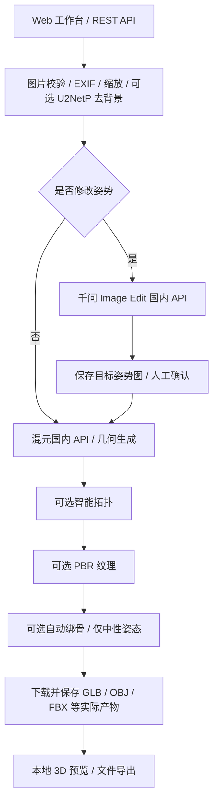

# 系统架构

## 数据流程

拓扑改变网格和 UV；纹理应应用到拓扑后的模型，绑骨应应用到最终网格。原始架构的三个分支不能简单合并文件作为一个一致资产。本项目采用显式串行依赖，并保留每个阶段的独立产物。

## 模块与责任

| 模块 | 职责 | 技术 |
| --- | --- | --- |
| Web | 上传、业务选项、姿势审核、任务历史、3D 预览、浏览器外观 | React / TypeScript / Three.js |
| API | 输入校验、任务/产物接口、配置能力公开 | FastAPI / Pydantic |
| Preprocessing | 图片归一化、可选前景分割 | Pillow / ONNX Runtime CPU |
| Pose | 角色 + 姿势图的多图编辑 | 阿里云百炼国内端点 |
| Geometry | 图像编码、几何推理、网格提取 | 腾讯混元云端内部实现，客户端不伪造独立 encoder |
| Topology / Texture / Rig | 独立异步云任务 | Tencent AI3D 2025-05-13 |
| Orchestrator | 阶段状态、失败传播、重启恢复 | SQLite + 单进程后台 worker |
| Assets | 本地持久化、限大小下载、受限下载域 | 文件系统 + 元数据 |

## 状态与部署

任务依次进入 queued → running → awaiting_review（姿势图）→ queued → running → succeeded；错误进入 failed。阶段记录供应商任务 ID、请求 ID、开始时间、状态和产物。网络不确定的提交不能重试；已知 ID 的查询可以重试。

数据库为 SQLite，先实现单实例串行 worker，以符合默认云服务并发限制。用进程文件锁拒绝多实例误启动。API 默认仅绑定 127.0.0.1。前端依赖构建后由本地提供，不使用外部 CDN。

## ADR-001：国内云端作为主路径

无本地 GPU；云端已有几何/拓扑/纹理/绑骨协议。选择腾讯云国内 AI3D，明确区分旧 hunyuan 国际端点。不开启大型权重下载。未来本地 Hunyuan3D adapter 必须单独验收。

## ADR-002：姿势控制采用前置图像编辑

已查阅混元 Pro 请求没有 Meshy Custom Pose 等价参数。选择千问多图编辑生成目标姿势图，强制人工确认以发现身份漂移和姿势错误。此为工程替代路线，不宣称内部骨骼约束等价。

## ADR-003：小模型本地使用

选 U²-NetP ONNX 轻量前景分割，下载后校验权重并脱网运行；记录来源与校验值。不能把轻量分割能力描述成高保真人体重建。

## ADR-004：平台凭据不属于客户端

顾客与商家不能填写或修改模型 API Key、服务 token 和服务地址。平台运维在
服务端 `.env` / 进程环境变量配置并重启后端，客户端只读取不含凭据及地址的
`/api/capabilities`。客户端保留生图模型下拉选择与本地主题偏好；不可用服务
显示“暂不可用”，不引导用户填写密钥。公网 Nginx 和配置了 public origin 的
FastAPI 都拒绝旧 `/api/settings`，该维护路径不在 OpenAPI 中公开。

账号、计费、权益、支付以及顾客资产的本地化属于后续商业模块，当前状态见
[实施计划](PLAN.md)；这一边界调整没有迁移或删除存量顾客数据。
